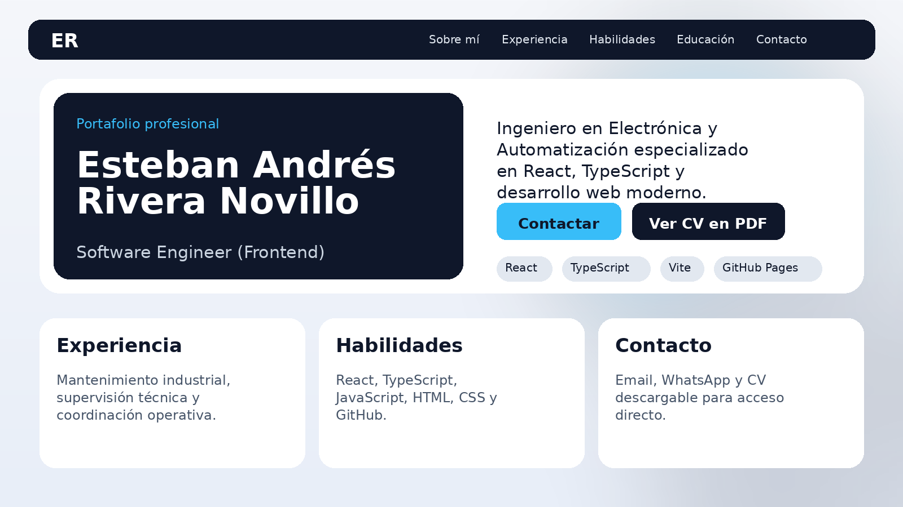

# Esteban Andrés Rivera Novillo

## Portafolio Web Profesional

Sitio web personal desarrollado para presentar mi perfil profesional, experiencia, habilidades técnicas y portafolio de proyectos en programación, automatización y desarrollo técnico.

### Vista del sitio
🔗 **Demo en línea:**  
[Ver portafolio web](https://earivera6.github.io/cv-esteban-web/)

---

## Sobre mí

Soy Ingeniero en Electrónica y Automatización con enfoque en desarrollo de software, especialmente en tecnologías frontend. Me interesa construir soluciones funcionales, claras y bien estructuradas, integrando programación, automatización y desarrollo técnico.

Actualmente utilizo este sitio como una vitrina profesional para mostrar:

- Mi perfil y experiencia
- Mis habilidades técnicas
- Mi formación académica
- Mi CV en PDF
- Proyectos que evidencian mis capacidades

---

## Tecnologías usadas

- React
- TypeScript
- Vite
- CSS
- Git
- GitHub Pages

---

## Secciones del sitio

- **Perfil**
- **Experiencia profesional**
- **Habilidades técnicas**
- **Educación**
- **Contacto**
- **Portafolio de proyectos** *(próximamente)*

---

## Captura del proyecto

Puedes agregar aquí una imagen de preview del sitio:

```md
